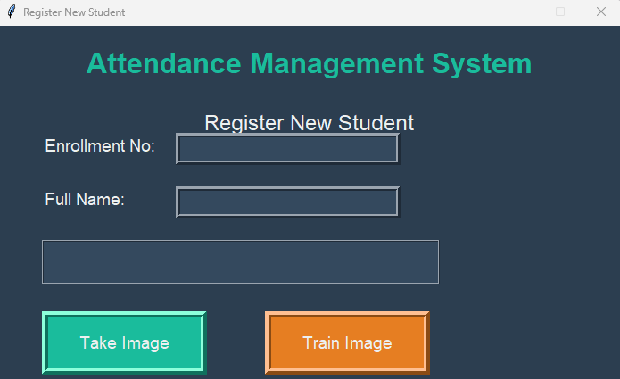
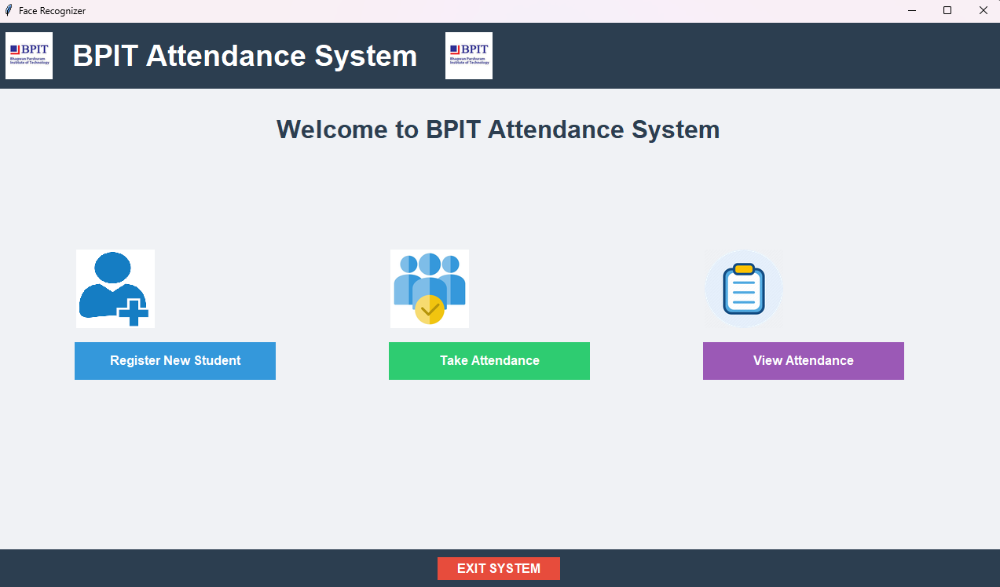
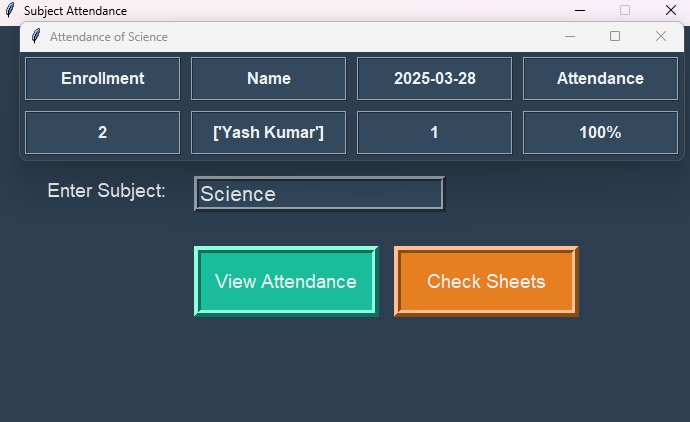
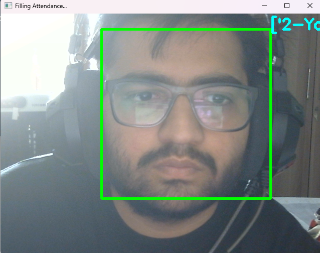

# Attendance Management System Using Face Recognition 📚👤✔️

[](https://www.python.org/downloads/)
[](https://opensource.org/licenses/MIT)
[](https://opencv.org/)

A Python-based attendance management system that automates attendance marking using real-time face recognition. Perfect for classrooms, offices, or events!

 <!-- Replace with your own GIF/screenshot -->

## Table of Contents
- [Features](#features)
- [How It Works](#how-it-works)
- [Requirements](#requirements)
- [Installation](#installation)
- [Usage](#usage)
- [Screenshots](#screenshots)
- [Contributing](#contributing)
- [License](#license)
- [Acknowledgments](#acknowledgments)
- [Contact](#contact)

## Features ✨
- **Student Registration**: Capture and store student faces with unique IDs.
- **Model Training**: Train a machine learning model on detected faces.
- **Automated Attendance**: Recognize faces in real-time and log attendance to CSV.
- **Attendance Records**: View, export, and manage attendance history.
- **User-Friendly GUI**: Built with Tkinter for easy navigation.

## How It Works 🤖
1. **Face Detection**: Uses Haar Cascade classifier to detect faces in real-time.
2. **Data Collection**: Captures and stores student face samples in the `dataset/` directory.
3. **Model Training**: Trains an LBPH (Local Binary Pattern Histogram) model for recognition.
4. **Recognition & Logging**: Recognizes registered faces and logs attendance with timestamps.
5. **Export Data**: Attendance records are saved in CSV format for easy access.

## Requirements 📦
- **Python 3.6+** ([Download Python](https://www.python.org/downloads/))
- **Libraries**:
  ```bash
  pip install opencv-python Pillow pandas numpy
  ```
- **Haar Cascade File**:
  Download `haarcascade_frontalface_default.xml` and place it in the project root.

## Installation 🛠️
### Clone the repository:
```bash
git clone https://github.com/Yashverma849/Attendance-Management-System-With-Face-Recognition.git
cd Attendance-Management-System-With-Face-Recognition
```
### Install dependencies:
```bash
pip install -r requirements.txt  # Create a requirements.txt with your libraries
```
### Place the Haar Cascade file in the project directory.

## Usage 🚀
### Register a New Student:
1. Click **Register** in the GUI.
2. Enter a student ID and name.
3. Look into the camera. The system will capture 100 face samples.

### Train the Model:
1. Click **Train Model**. This processes all images and creates a `trainer.yml` file.

### Take Attendance:
1. Click **Take Attendance**. The system will recognize faces and log attendance in `attendance.csv`.

### View Attendance:
1. Click **View Attendance** to see the CSV file in your default application.

## Screenshots 📸

### Registration Page


### Homepage


### Attendance Log



### Face Recognition in Action


### Taking Attendance


## Contributing 🤝
Contributions are welcome! Please fork the repository and submit a pull request. For major changes, open an issue first.

## License 📄
This project is licensed under the MIT License. See [LICENSE](LICENSE) for details.

## Acknowledgments 🙏
- OpenCV for face detection and recognition.
- Tkinter for the GUI framework.
- Pillow for image processing.

## Contact 📧
For questions or feedback, reach out to **Yash Verma** at **yash.verma.connect.com**.

---
